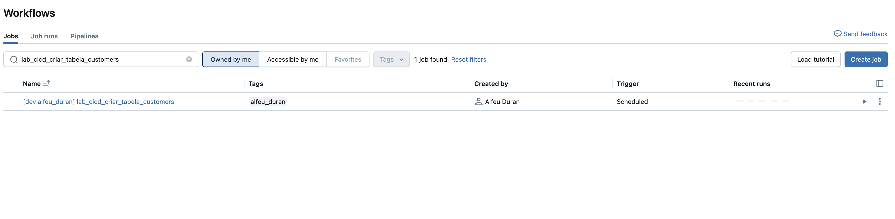
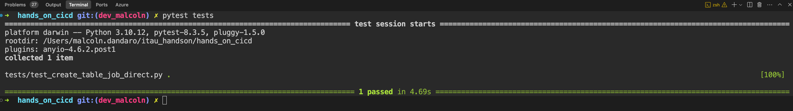
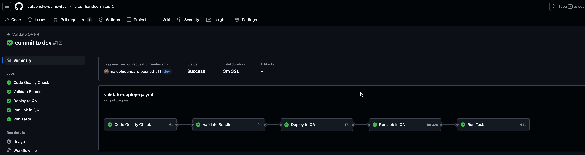
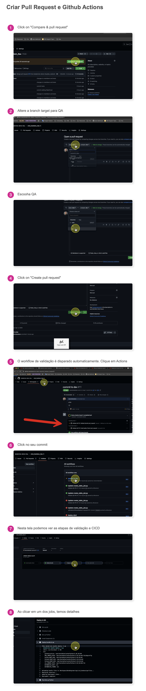

# CI/CD Hands-On with Databricks

This repository contains the code and configurations required for the CI/CD workshop with Databricks.

As this is a workshop, the job source code has been simplified for educational purposes.

Due to the complexity of demonstrating a complete end-to-end CI/CD scenario (which involves Git, CLI, runners, and other external objects), this repository has been prepared with a ready-to-use structure containing the following Databricks assets:

- Notebook that creates an employee table
- Workflow configured to run this Notebook
- Predefined unit tests
- CI/CD pipeline using GitHub Actions already configured

## Table of Contents

1. [Prerequisites](#prerequisites)
2. [Tools Used](#tools-used)
3. [Step by Step](#step-by-step)
   - [Step 1: Installing Databricks CLI](#step-1-installing-databricks-cli)
   - [Step 2: Cloning the Repository](#step-2-cloning-the-repository)
   - [Step 3: Importing an Existing Job](#step-3-importing-an-existing-job)
   - [Step 4: Setting Environment Variables](#step-4-setting-environment-variables)
   - [Step 5: Deployment to Different Environments](#step-5-deployment-to-different-environments)
   - [Step 6: Running the Job](#step-6-running-the-job)
4. [Running Unit and Integration Tests](#running-unit-and-integration-tests)
   - [About Databricks Connect](#about-databricks-connect)
   - [Test Prerequisites](#test-prerequisites)
   - [Test Structure](#test-structure)
   - [Running the Tests](#running-the-tests)
5. [Static Code Validation with Flake8](#static-code-validation-with-flake8)
6. [GitHub Actions](#github-actions)
   - [Workflow with GitHub Actions](#workflow-with-github-actions)
7. [Reference](#reference)
   - [Repository Structure](#repository-structure)

## Prerequisites

- Prior knowledge of Git
- Prior knowledge of CI/CD concepts
- Access to a Databricks workspace
- Databricks access token

## Tools Used

In this workshop, we will use the following tools to implement the CI/CD pipeline:

### Databricks CLI
The [Databricks CLI](https://docs.databricks.com/aws/en/dev-tools/cli/) is a command-line interface that allows you to interact with the Databricks platform from your local terminal or automation scripts. It wraps the Databricks REST API, providing endpoints to modify or request information about Databricks workspace objects.

### Databricks Asset Bundles
[Databricks Asset Bundles](https://docs.databricks.com/aws/en/dev-tools/bundles) are a tool that facilitates the adoption of software engineering best practices, including source control, code review, testing, and continuous integration and delivery (CI/CD) for your data and AI projects. Bundles allow you to describe Databricks resources such as jobs, pipelines, and notebooks as source files.

### Databricks Connect
[Databricks Connect](https://docs.databricks.com/aws/en/dev-tools/databricks-connect/python/) is a client library that allows you to connect your local development environment to Databricks. This enables:
- Local development
- Continuous integration
- Remote debugging
- Automated test execution that interacts with the Databricks environment

### GitHub Actions
[GitHub Actions](https://github.com/features/actions) is an automation platform that allows you to create CI/CD workflows directly in your GitHub repository. With GitHub Actions, you can automate, customize, and run your software development workflows directly on GitHub.

## Step by Step

### Step 1: Installing Databricks CLI

Install the Databricks CLI using pip:

```bash
pip install databricks-cli
```

Generate the Databricks access token (we will use it in the next step)


Configure access to Databricks:

```bash
databricks configure --token
```

You will be prompted to provide:
- URL of your Databricks workspace (e.g., https://adb-123456789.4.azuredatabricks.net)
- Personal access token

It is also possible to use browser authentication if you prefer.

### Step 2: Cloning the Repository

Clone this repository to your local environment:

```bash
git clone https://github.com/alfeuduran/databricks-lab-example-port.git

cd databricks-lab-example-port
```
The repository is already configured with an existing job that creates an employee table and a workflow configured to run this job.
If you want to use a different job, you can follow step 3.
### (Optional) Step 3: Importing an Existing Job

To start, import an existing job from Databricks:

```bash
databricks bundle generate job --existing-job-id 663063874671210 -t dev
```

Where:
- `--existing-job-id 663063874671210` specifies the ID of the job you want to import
- `-t dev` specifies the target environment from which the job will be imported

This command will generate the necessary configuration files so you can work with the job locally.

#### Example Execution

When we run the command to import an existing job:

```bash
> databricks bundle generate job --existing-job-id 393880860618601 -t dev -p dev
File successfully saved to src/create_table_job.py
Job configuration successfully saved to resources/lab_cicd_criar_tabela_funcionario.yml
```

As we can see:
- The job's SQL file was saved in the `src/` directory
- The job configuration was saved in the `resources/` directory

### Step 4: Setting Environment Variables

#### Catalog Configuration

In the imported job (`lab_cicd_criar_tabela_funcionario.job.yml.job.yml`), we use parameterized variables to ensure portability between different environments:

```
catalogo: ${catalogo}
```

This approach allows the same job to be run in different environments (dev, qa, prod), using the appropriate catalog for each one.

#### How It Works

1. In the `databricks.yml` file, we define the different environments and their respective configurations.
2. For each environment (target), we specify the value that should be used for the `catalogo` variable.
3. When we deploy or run the job in a specific environment, the system replaces the `${catalogo}` variable with the value configured for that environment.

For example:
- In the `dev` environment, `${catalogo}` can be replaced by `catalogo_dev`
- In the `qa` environment, `${catalogo}` can be replaced by `catalogo_qa`
- In the `prod` environment, `${catalogo}` can be replaced by `catalogo_prod`

### Step 5: Deployment to Different Environments

To deploy the job to a specific environment:

```bash
databricks bundle deploy -t dev
```

This command will deploy the job to the development environment (`dev`), replacing the `${catalogo}` variable with the value defined for this environment.

To deploy to other environments:

```bash
databricks bundle deploy -t qa     # Deploy to QA environment
databricks bundle deploy -t prod   # Deploy to production environment
```

### Step 6: Running the Job

To run the job in a specific environment:

```bash
databricks bundle run -t dev
```
*If there is more than one job in the bundle, you will be prompted to choose which job to run.*


#### Deployment Result

After running the deployment command, the job will be created in Databricks with the logged-in user as the owner:



Note that:
- The job name includes a prefix indicating the environment (`[dev_alfeu_duran]`)
- The user who ran the deployment command is automatically set as the job owner
- The job tags are preserved during deployment

## Running Unit and Integration Tests

This project uses pytest for unit tests and Databricks Connect to run tests that interact with a Databricks environment.

### About Databricks Connect

Databricks Connect is a client library that allows you to connect your local development environment to Databricks. This enables:

- **Local development**: Write and test code locally before deploying it to Databricks
- **Continuous integration**: Run automated tests that interact with the Databricks environment
- **Remote debugging**: Debug code that will run on the Databricks cluster directly from your IDE

With Databricks Connect, your tests can:
1. Create and manipulate tables in Databricks
2. Run SQL queries and check results
3. Simulate job execution exactly as it would happen in the Databricks environment
4. Access Unity Catalog, Delta Lake, and other Databricks features

This eliminates the need for extensive mocks and allows for more realistic tests that validate the full interaction with the Databricks platform.

### Test Prerequisites

1. Install test dependencies:
   ```bash
   pip install -r requirements.txt
   ```
2. Databricks CLI configured (done at the beginning of this document)


### Test Structure

The tests are organized as follows:

- `tests/test_create_table_job.py`: Tests to validate table creation and data manipulation in Databricks

These simplified Unit and Integration tests check:
1. If the table was created
1. The structure of the created table (expected columns)
2. The count of records inserted into the table
3. If there are null values in the CPF field
3. If a specific record is present in the table

### Running the Tests

**Important**: The tests are configured to run after the table is created in the `hml_hands_on` catalog. This is set in the `tests/test_create_table_job_direct.py` file, which checks for the existence and content of the table in this specific catalog.
Change the environment variables to the correct catalog and schema before running the tests.

- The default catalog set is: `hml_hands_on`  (if running in the dev environment, change to `dev_hands_on`)

- The schema set is: `alfeu_duran` (change to your user schema, which was automatically created when the job was run)


To run all tests (after running the job and changing the variables in the pytest file):
```bash
pytest tests/
```



To run a specific test:
```bash
pytest tests/test_create_table_job.py
```

To run with detailed information:
```bash
pytest tests/ -v
```

## Static Code Validation with Flake8

Flake8 is a linter that checks Python code quality. It is configured to check for:

- Syntax errors
- Style errors
- Complexity errors

We have configured Flake8 to check the code during CI/CD with GitHub Actions.


## GitHub Actions

To automate the CI/CD process, a workflow has been configured in GitHub Actions. The file `.github/workflows/validate-deploy-qa.yml` defines the pipeline that runs when a Pull Request is opened or updated on the `qa` branch.



Our pipeline consists of 5 sequential jobs, which are explained in detail below:

1. **Code Quality Check**
   - Checks code quality using Flake8
   - Analyzes code complexity and style
   - Ensures there are no syntax errors

2. **Validate Bundle**
   - Validates the Databricks bundle configuration
   - Checks if all configurations are correct for the QA environment

3. **Deploy to QA**
   - Deploys the job to the QA environment
   - Uses credentials configured in GitHub Secrets

4. **Run Job in QA**
   - Runs the job in the QA environment
   - Checks if the job runs successfully

5. **Run Tests**
   - Runs unit and integration tests
   - Checks if the tests pass after deployment


## Workflow with GitHub Actions
Visual diagram of the workflow with GitHub Actions:




The workflow with GitHub Actions follows these steps:

1. **Development on the Dev Branch**
   - Developers commit to the `dev` branch
   - This is the development branch where new features are implemented

2. **Pull Request to QA**
   - When the code is ready, a Pull Request is created from `dev` to `qa`
   - This process can be automated with tools like GitHub Auto-PR
   - The PR automatically triggers the validation workflow

3. **Workflow Execution**
   - The workflow defined in `.github/workflows/validate-deploy-qa.yml` is executed
   - All 5 jobs are run sequentially
   - Any failure in one of the jobs stops the process

4. **QA Branch Protection**
   - The `qa` branch is protected by branch protection rules
   - Merging is only allowed if all workflow checks pass
   - This ensures that only validated code reaches the QA environment

5. **Merge or Rejection**
   - If all checks pass, the PR can be approved and merged
   - If there are failures, the PR is blocked until the issues are fixed
   - The developer receives immediate feedback on any problems

This workflow ensures code quality and the integrity of the QA environment, establishing a robust CI/CD process.


Example workflow configuration:

```yaml
name: Validate QA PR

on:
  pull_request:
    branches:
      - qa
    types: [opened, synchronize, reopened]

jobs:
  code_quality:
    name: Code Quality Check
    runs-on: ubuntu-latest
    steps:
      - name: Checkout code
        uses: actions/checkout@v4
      
      - name: Set up Python
        uses: actions/setup-python@v4
        with:
          python-version: '3.10'
      
      - name: Install Flake8
        run: |
          python -m pip install --upgrade pip
          pip install flake8
          
      - name: Run Flake8
        run: |
          flake8 src/ --count --select=E9,F63,F7,F82 --ignore=F821 --show-source --statistics
```

This workflow ensures that:
- The code complies with quality standards
- The bundle is correctly configured
- Deployment is successful
- The job runs correctly
- Tests pass after deployment

For the workflow to work correctly, you need to configure the following secrets in GitHub:
- `DATABRICKS_HOST_HML`: Databricks workspace URL
- `DATABRICKS_TOKEN_HML`: Databricks access token

---

## Reference

- [Databricks CLI](https://docs.databricks.com/aws/en/dev-tools/cli/)
- [Databricks Asset Bundles](https://docs.databricks.com/aws/en/dev-tools/bundles)
- [Databricks Connect](https://docs.databricks.com/aws/en/dev-tools/databricks-connect/python/)